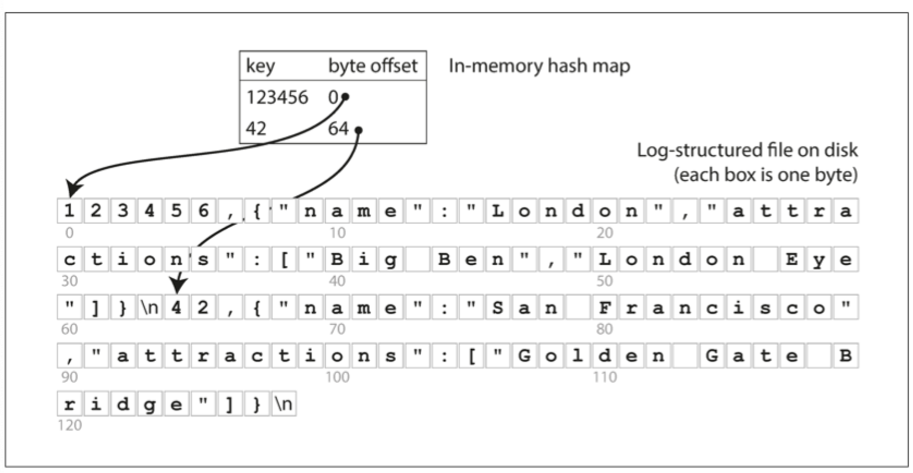

## 개요

본 글에서는 읽기 성능의 핵심인 `색인(index)`에 대한 여러 가지 방법을 살펴보고 `저장 구조`와 `쓰기`를 함께 연관 지어 생각해 본다.

### 인메모리 해시 맵

- 키-저장소 구조이며 일반적인 사전 타입(dictionary type)이며 일반적인 해시 맵(hash map)으로 구현한다.

- 검색하고자 하는 키에 바이트 offset을 매핑하여 해시 맵을 구성한다.
- 검색하고자 하는 키를 통해 데이터 시작 점인 바이트 offset을 빠르게 찾을 수 있다.
  - 위의 그림을 기준으로 설명
    - 키가 "123456"인 경우 바이트 offset이 0 이므로 "1" 부터 데이터 시작임을 알 수 있다.
    - 키가 "42" 인 경우 바이트 offset이 64 이므로 중간 줄에 "4" 부터 데이터 시작임을 알 수 있다.