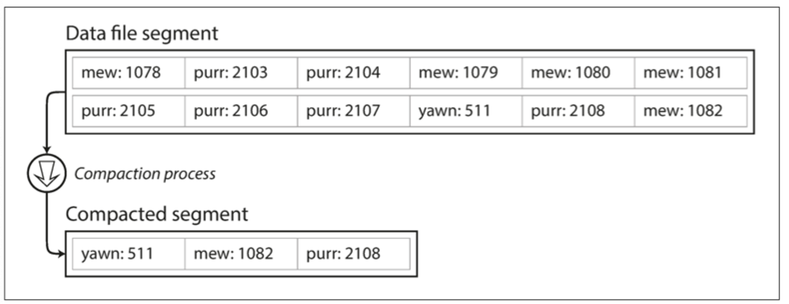

## 개요

본 글에서는 읽기 성능의 핵심인 `색인(index)`에 대한 여러 가지 방법을 살펴보고 `저장 구조`와 `쓰기`를 함께 연관 지어 생각해 본다.

### 인메모리 해시 맵

- 키-저장소 구조이며 일반적인 사전 타입(dictionary type)이며 일반적인 해시 맵(hash map)으로 구현한다.

- 검색하고자 하는 키에 바이트 offset을 매핑하여 해시 맵을 구성한다.
- 검색하고자 하는 키를 통해 데이터 시작 점인 바이트 offset을 빠르게 찾을 수 있다.

> #### :arrow_up: 위의 그림을 기준으로 설명
> - 키가 "123456"인 경우 바이트 offset이 0 이므로 "1" 부터 데이터 시작임을 알 수 있다.
> - 키가 "42" 인 경우 바이트 offset이 64 이므로 중간 줄에 "4" 부터 데이터 시작임을 알 수 있다.
- 모든 데이터에 대한 해시 맵을 전부 메모리 올려 관리한다.
  - 메모리에 저장하므로 키가 너무 많으면 문제가 된다.

### 데이터의 디스크 저장, 세그먼트 컴팩션(compaction)과 병합(merge)

- 계속 데이터가 추가되면 디스크 공간이 부족하다.
- 데이터의 컴팩션(compaction)을 수행하여 디스크 사용 공간을 줄일 수 있다.
- 하나의 파일로 데이터를 관리하는 경우 컴팩션하기에는 어려움이 있다.
  - 사용자 요청을 처리하며 데이터 압축을 하면 성능 저하가 발생할 가능성이 커진다.
    - 압축된 데이터를 읽기 위해서는 실시간으로 해제가 필요하다.
  - 실시간 압축 및 해제 과정에서 데이터 유실 및 정합성 문제가 발생할 가능성이 커진다.
- 효율적인 데이터 관리를 위해 특정 크기의 세그먼트(compaction)로 데이터 로그를 분리할 수 있다.

- 분리된 세그먼트에서 중복된 키를 제거하고 최신 키의 값만 유지하여 컴팩션을 수행하며 새로운 파일을 생성한다.
  - 참고 : 세그먼트 데이터는 쓰여진 후에는 변경할수 없고 계속 추가(append)만 된다.
- 컴팩션이 완료되면 새로운 세그먼트로 사용을 전환하고 이전 세그먼트를 삭제한다.

> #### :arrow_up: 위의 그림을 기준으로 설명
> - "yawn", "mew", "purr"의 최신 값은 511, 1082 2108이다.
> - 최신 값만 사용하여 새로운 세그먼트 파일을 생성한다.
> - 새로 생성산 컴팩트된 세그먼트를 읽기에서 사용하고 이전의 세그먼트를 삭제한다.

- 세그먼트 컴팩션과 동시에 병합을 할 수 있다.
- 병합할 세그먼트 파일을 대상으로 컴팩션을 수행하며 중복된 키에 대해 최신 값을 유지하여 새로운 세그먼트를 만든다.

> #### :sparkles: 세그먼트를 이용한 데이터 조회
> - 세그먼트(컴팩션 여부와 상관없이) 데이터의 키와 파일 오프셋을 매핑한 인메모리 해시 맵을 갖는다.
> - 최신 세그먼트 해시 맵을 확인하고 키가 없다면 다음 세그먼트 등을 확인한다.
>   - 병합 과정을 통해 세그먼트 수를 적게 유지하기 때문에 조회할 때 많은 해시 맵을 확인할 필요가 없다.