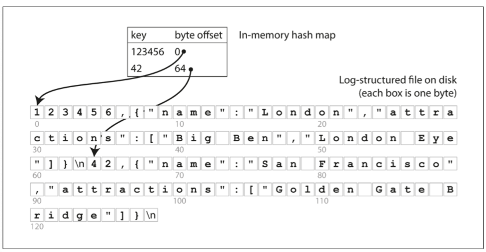
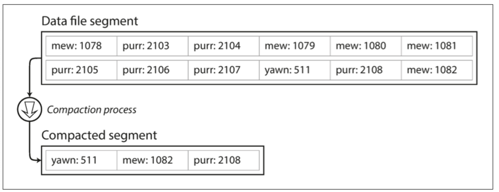
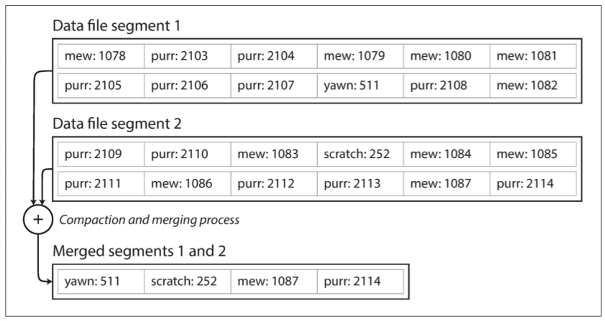

## 개요

본 글에서는 읽기 성능을 위한 `색인(index)` 중에 `해시 색인`에 대한 내용을 살펴본다.

### 인메모리 해시 맵

- 키-저장소 구조이며 일반적인 사전 타입(dictionary type)이며 일반적인 해시 맵(hash map)으로 구현한다.

- 검색하고자 하는 키에 바이트 offset을 매핑하여 해시 맵을 구성한다.
- 검색하고자 하는 키를 통해 데이터 시작 점인 바이트 offset을 빠르게 찾을 수 있다.

> #### :arrow_up: 위의 그림을 기준으로 설명
> - 키가 "123456"인 경우 바이트 offset이 0 이므로 "1" 부터 데이터 시작임을 알 수 있다.
> - 키가 "42" 인 경우 바이트 offset이 64 이므로 중간 줄에 "4" 부터 데이터 시작임을 알 수 있다.
- 모든 데이터에 대한 해시 맵을 전부 메모리 올려 관리한다.
  - 메모리에 저장하므로 키가 너무 많으면 문제가 된다.

### 데이터의 디스크 저장, 세그먼트 컴팩션(compaction)과 병합(merge)

- 계속 데이터가 추가되면 디스크 공간이 부족하다.
- 데이터의 컴팩션(compaction)을 수행하여 디스크 사용 공간을 줄일 수 있다.
- 하나의 파일로 데이터를 관리하는 경우 컴팩션하기에는 어려움이 있다.
  - 사용자 요청을 처리하며 데이터 압축을 하면 성능 저하가 발생할 가능성이 커진다.
    - 압축된 데이터를 읽기 위해서는 실시간으로 해제가 필요하다.
  - 실시간 압축 및 해제 과정에서 데이터 유실 및 정합성 문제가 발생할 가능성이 커진다.
- 효율적인 데이터 관리를 위해 특정 크기의 세그먼트(compaction)로 데이터 로그를 분리할 수 있다.

- 분리된 세그먼트에서 중복된 키를 제거하고 최신 키의 값만 유지하여 컴팩션을 수행하며 새로운 파일을 생성한다.
  - 참고 : 세그먼트 데이터는 쓰여진 후에는 변경할수 없고 계속 추가(append)만 된다.
- 컴팩션이 완료되면 새로운 세그먼트로 사용을 전환하고 이전 세그먼트를 삭제한다.

> #### :arrow_up: 위의 그림을 기준으로 설명
> - "yawn", "mew", "purr"의 최신 값은 511, 1082 2108이다.
> - 최신 값만 사용하여 새로운 세그먼트 파일을 생성한다.
> - 새로 생성산 컴팩트된 세그먼트를 읽기에서 사용하고 이전의 세그먼트를 삭제한다.

> #### :thought_balloon: 세그먼트로 데이터 파일을 분리하면 어떤 이점이 있을까?
> 1. 공간 효율성 증가 및 성능 향상
>   - 필요한 데이터만을 선택적으로 쓰거나 읽을 수 있다.
>   - 전체 파일을 저장하거나 처리할 필요 없다.
> 2. 데이터 관리 용이성
>    - 손상된 세그먼트를 복구하거나 교체하는 것도 더욱 용이하다.
> 3. 확장성
>    - 세그먼트를 다른 저장 장치에 분산이 가능하고 성능과 용량을 쉽게 확장할 수 있다.

- 세그먼트 컴팩션과 동시에 병합을 할 수 있다.
- 병합할 세그먼트 파일을 대상으로 컴팩션을 수행하며 중복된 키에 대해 최신 값을 유지하여 새로운 세그먼트를 만든다.

> #### :sparkles: 세그먼트를 이용한 데이터 조회
> - 세그먼트(컴팩션 여부와 상관없이) 데이터의 키와 파일 오프셋을 매핑한 인메모리 해시 맵을 갖는다.
> - 최신 세그먼트 해시 맵을 확인하고 키가 없다면 다음 세그먼트 등을 확인한다.
>   - 병합 과정을 통해 세그먼트 수를 적게 유지하기 때문에 조회할 때 많은 해시 맵을 확인할 필요가 없다.

> #### :thought_balloon: 세그먼트의 구체적인 구현을 어떻게 할까?
> 1. 파일 형식
>   - CSV, JSON 등 여러 데이터 형태가 있으며 이스케이프 문자 등과 같은 구분 문자열로 구분하여 데이터를 저장할 수 있다.
>   - 바이트 단위로 변환하여 저장하거나 바이트 단위의 문자열로 부호화하고 바이너리 형식으로 저장할 수 있다.
> 2. 레코드 삭제
>    - 삭제한 경우 특수한 삭제 레코드를 삭제한다.
>    - 세그먼트 병합에서 툼스톤은 키의 이전 값을 무시한다.
> 3. 고장 복구
>    - 결함으로 인해 인메모리 해시 맵은 사라진다.
>    - 전체 세그먼트를 통해 다시 해시 맵을 복구하면 비용이 크기 때문에 해시 맵에 대한 스냅샷을 디스크에 저장하여 복구의 비용을 줄인다.
> 4. 부분 레코드 쓰기
>    - 체크 섬을 통해 레코드를 추가하는중에 발생한 장애에 대해 손상된 로그를 탐지한다. 
> 5. 동시성 제어
>    - 순차적인 로그 추가를 위해 정의한 단위별로 스레드를 하나만 사용할 수 있다.
>    - 세그먼트는 추가만 되거나 불변이기에 읽기는 다중 스레드를 사용할 수 있다.많

### 질문

> #### :thought_balloon: 세그먼트로 데이터 파일을 분리하면 어떤 이점이 있을까?
> #### :thought_balloon: 디스크에 해시 맵을 유지하면 좋은 성능을 왜 기대하기 어려울까?
> #### :thought_balloon: 해시 테이블은 왜 범위 질의에 효율적이지 않을까?